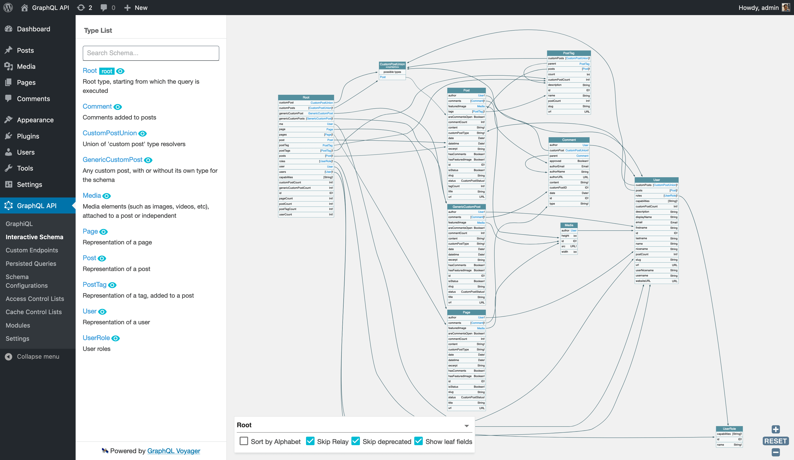

<p align="center"></p>

# GraphQL API for WordPress

[![Build Status][ico-travis]][link-travis]
[![Quality Score][ico-code-quality]][link-code-quality]
[![Software License][ico-license]](LICENSE.md)
<!-- [![GitHub release][ico-release]][link-release] -->
<!-- [![Github all releases][ico-downloads]][link-downloads] -->

Transform your WordPress site into a GraphQL server.

This plugin is the implementation for WordPress of [GraphQL by PoP](https://graphql-by-pop.com/), a CMS-agnostic GraphQL server in PHP.

## Why

Please read the author's [introduction to the GraphQL API for WordPress](https://leoloso.com/posts/introducing-the-graphql-api-for-wordpress/), which describes:

- How does it compare with the existing solutions: WP REST API and WPGraphQL
- Its most important features
- An overview of all its features
- Q&A

## Requirements

WordPress 5.4 or above, PHP 7.2.5 or above.

## Install

Download [the latest release of the plugin](https://github.com/GraphQLAPI/graphql-api/releases/download/v0.1.22/graphql-api.zip) as a .zip file.

Then, in the WordPress admin:

- Go to `Plugins => Add New`
- Click on `Upload Plugin`
- Select the .zip file
- Click on `Install Now` (it may take a few minutes)
- Once installed, click on `Activate`

After installed, there will be a new "GraphQL API" section on the menu:



### Ready for production?

This plugin requires 3rd party dependencies, but they have not been scoped yet (see [issue #9](https://github.com/GraphQLAPI/graphql-api/issues/9)). So please install this plugin in a development environment first, to make sure there are no conflicts with the other plugins installed in the site.

If any problem arises, either installing or running the plugin, please [create a new issue](https://github.com/GraphQLAPI/graphql-api/issues/new).

## Development

Clone repo, and then install Composer dependencies, by running:

```bash
$ git clone https://github.com/GraphQLAPI/graphql-api.git
$ cd graphql-api
$ composer install
```

### Launch a development environment with `wp-env`

Launch a WordPress environment with the GraphQL API plugin activated through [`wp-env`](https://www.npmjs.com/package/@wordpress/env).

[Prerequisites](https://www.npmjs.com/package/@wordpress/env#prerequisites):

- Node.js
- npm
- Docker

To [install `wp-env`](https://www.npmjs.com/package/@wordpress/env#installation) globally, run in the terminal:

```bash
npm -g i @wordpress/env
```

To start a new WordPress instance with the GraphQL API plugin already installed and activated, execute in the root folder of the plugin (make sure Docker is running):

```bash
wp-env start
```

> Please notice: The first time using `wp-env`, this process may take a long time (half an hour or even more). To see what is happening, execute with the `--debug` option: `wp-env start --debug`

<!-- The first time, change the permalink structure to use pretty permalinks:

```bash
wp-env run cli wp rewrite structure '/%postname%/'
``` -->

The site will be available under `http://localhost:6666`.

To access the wp-admin, under `http://localhost:6666/wp-admin/`:

- User: `admin`
- Password: `password`

To enable pretty permalinks, run:

```bash
wp-env run cli wp rewrite structure '/%postname%/'
```

### Pulling code

Whenever pulling changes from this repo, install again the dependencies:

```bash
composer install
```

### Pushing code

Compiled JavaScript code (such as all files under a block's `build/` folder) is added to the repo, but only as compiled for production, i.e. after running `npm run build`.

Code compiled for development, i.e. after running `npm start`, is not allowed in the repo.

### Clone own dependencies

GraphQL API is not a monorepo. Instead, its code is distributed across packages (living in repos from [PoP](https://github.com/getpop), [GraphQLByPoP](https://github.com/GraphQLByPoP) and [PoPSchema](https://github.com/PoPSchema)), and managed through Composer.

File [`dev-helpers/scripts/clone-all-dependencies-from-github.sh`](https://github.com/GraphQLAPI/graphql-api/blob/master/dev-helpers/scripts/clone-all-dependencies-from-github.sh) contains the list of all own dependencies, ready to be cloned.

For development, the GraphQL API plugin can use these local projects by overriding Composer's autoload `PSR-4` sources. To do so:

- Duplicate file [`composer.local-sample.json`](https://github.com/GraphQLAPI/graphql-api/blob/master/composer.local-sample.json) as `composer.local.json`
- Customize it with the paths to the folders

This file will override any corresponding entry defined in `composer.json`.

## Modules

GraphQL API is extensible, and ships with the following modules:

_(The documentation for the modules is currently being created)_

| Module | Description |
| --- | --- |
| **Single Endpoint**<!--**[Single Endpoint](docs/en/modules/single-endpoint.md)**--> | Expose a single GraphQL endpoint under <code>/graphql/</code>, with unrestricted access |
| **GraphiQL for Single Endpoint**<!--**[GraphiQL for Single Endpoint](docs/en/modules/graphiql-for-single-endpoint.md)**--> | Make a public GraphiQL client available under <code>/graphiql/</code>, to execute queries against the single endpoint. It requires pretty permalinks enabled |
| **Interactive Schema for Single Endpoin**t<!--**[Interactive Schema for Single Endpoint](docs/en/modules/interactive-schema-for-single-endpoint.md**)--> | Make a public Interactive Schema client available under <code>/schema/</code>, to visualize the schema accessible through the single endpoint. It requires pretty permalinks enabled |
| **Persisted Queries**<!--**[Persisted Queries](docs/en/modules/persisted-queries.md**)--> | Expose predefined responses through a custom URL, akin to using GraphQL queries to publish REST endpoints |
| **Custom Endpoints**<!--**[Custom Endpoints](docs/en/modules/custom-endpoints.md**)--> | Expose different subsets of the schema for different targets, such as users (clients, employees, etc), applications (website, mobile app, etc), context (weekday, weekend, etc), and others |
| **GraphiQL for Custom Endpoint**s<!--**[GraphiQL for Custom Endpoints](docs/en/modules/graphiql-for-custom-endpoints.md**)--> | Enable custom endpoints to be attached their own GraphiQL client, to execute queries against them |
| **Interactive Schema for Custom Endpoints**<!--**[Interactive Schema for Custom Endpoints](docs/en/modules/interactive-schema-for-custom-endpoints.md**)--> | Enable custom endpoints to be attached their own Interactive schema client, to visualize the custom schema subset |
| **Schema Configuration**<!--**[Schema Configuration](docs/en/modules/schema-configuration.md)**--> | Customize the schema accessible to different Custom Endpoints and Persisted Queries, by applying a custom configuration (involving namespacing, access control, cache control, and others) to the grand schema |
| [Schema Namespacing](docs/en/modules/schema-namespacing.md) | Automatically namespace types and interfaces with a vendor/project name, to avoid naming collisions |
| **Access Control**<!--**[Access Control](docs/en/modules/access-control.md)**--> | Set-up rules to define who can access the different fields and directives from a schema |
| **Access Control Rule: Disable Acces**s<!--**[Access Control Rule: Disable Access](docs/en/modules/access-control-rule-disable-access.md)**--> | Remove access to the fields and directives |
| **Access Control Rule: User Stat**e<!--**[Access Control Rule: User State](docs/en/modules/access-control-rule-user-state.md**)--> | Allow or reject access to the fields and directives based on the user being logged-in or not |
| **Access Control Rule: User Role**s<!--**[Access Control Rule: User Roles](docs/en/modules/access-control-rule-user-roles.md**)--> | Allow or reject access to the fields and directives based on the user having a certain role |
| **Access Control Rule: User Capabilitie**s<!--**[Access Control Rule: User Capabilities](docs/en/modules/access-control-rule-user-capabilities.md**)--> | Allow or reject access to the fields and directives based on the user having a certain capability |
| **Public/Private Schema**<!--**[Public/Private Schema](docs/en/modules/public-private-schema.md)**--> | Enable to communicate the existence of some field from the schema to certain users only (private mode) or to everyone (public mode). If disabled, fields are always available to everyone (public mode) |
| **Cache Control**<!--**[Cache Control](docs/en/modules/cache-control.md)**--> | Provide HTTP Caching for Persisted Queries, sending the Cache-Control header with a max-age value calculated from all fields in the query |
| **Field Deprecation**<!--**[Field Deprecation](docs/en/modules/field-deprecation.md)**--> | Deprecate fields, and explain how to replace them, through a user interface |
| **API Hierarchy**<!--**[API Hierarchy](docs/en/modules/api-hierarchy.md)**--> | Create a hierarchy of API endpoints extending from other endpoints, and inheriting their properties |
| **Low-Level Query Editing**<!--**[Low-Level Query Editing](docs/en/modules/low-level-query-editing.md)**--> | Have access to schema-configuration low-level directives when editing GraphQL queries in the admin |
| **GraphiQL Explorer**<!--**[GraphiQL Explorer](docs/en/modules/graphiql-explorer.md**)--> | Add the Explorer widget to the GraphiQL client when creating Persisted Queries, to simplify coding the query (by point-and-clicking on the fields) |
| **Schema Editing Access**<!--**[Schema Editing Access](docs/en/modules/schema-editing-access.md)**--> | Grant access to users other than admins to edit the GraphQL schema |
| **Excerpt as Description**<!--**[Excerpt as Description](docs/en/modules/excerpt-as-description.md)**--> | Provide a description of the different entities (Custom Endpoints, Persisted Queries, and others) through their excerpt |
| **Configuration Cache**<!--**[Configuration Cache](docs/en/modules/configuration-cache.md)**--> | Cache the generated application configuration to disk |
| **Schema Cache**<!--**[Schema Cache](docs/en/modules/schema-cache.md)**--> | Cache the generated schema to disk |
| **Schema Custom Posts**<!--**[Schema Custom Posts](docs/en/modules/schema-customposts.md)**--> | Base functionality for all custom posts |
| **Schema Generic Custom Posts**<!--**[Schema Generic Custom Posts](docs/en/modules/schema-generic-customposts.md)**--> | Query any custom post type (added to the schema or not), through a generic type <code>GenericCustomPost</code> |
| **Schema Posts**<!--**[Schema Posts](docs/en/modules/schema-posts.md)**--> | Query posts, through type <code>Post</code> added to the schema |
| **Schema Pages**<!--**[Schema Pages](docs/en/modules/schema-pages.md)**--> | Query pages, through type <code>Page</code> added to the schema |
| **Schema Users**<!--**[Schema Users](docs/en/modules/schema-users.md)**--> | Query users, through type <code>User</code> added to the schema |
| **Schema User Roles**<!--**[Schema User Roles](docs/en/modules/schema-user-roles.md**)--> | Query user roles, through type <code>UserRole</code> added to the schema |
| **Schema Comments**<!--**[Schema Comments](docs/en/modules/schema-comments.md)**--> | Query comments, through type <code>Comment</code> added to the schema |
| **Schema Tags**<!--**[Schema Tags](docs/en/modules/schema-tags.md)**--> | Base functionality for all tags |
| **Schema Post Tags**<!--**[Schema Post Tags](docs/en/modules/schema-post-tags.md**)--> | Query post tags, through type <code>PostTag</code> added to the schema |
| **Schema Media**<!--**[Schema Media](docs/en/modules/schema-media.md)**--> | Query media elements, through type <code>Media</code> added to the schema |
---

## Resources

The following videos show several features:

- [Persisted queries](https://vimeo.com/413503547)
- [Custom endpoints](https://vimeo.com/413503485)
- [Access control](https://vimeo.com/413503383)
- [Public/private API](https://vimeo.com/413503284)
- [HTTP caching](https://vimeo.com/413503188)
- [Field deprecation](https://vimeo.com/413503110)
- [Query inheritance](https://vimeo.com/413503010)

For technical information on how the GraphQL server works, check out [GraphQL by PoP's documentation](https://graphql-by-pop.com/docs/getting-started/intro.html) and [resources](https://graphql-by-pop.com/resources/) (these are still a work in progress).

## Standards

[PSR-1](https://www.php-fig.org/psr/psr-1), [PSR-4](https://www.php-fig.org/psr/psr-4) and [PSR-12](https://www.php-fig.org/psr/psr-12).

## Change log

Please see [CHANGELOG](CHANGELOG.md) for more information on what has changed recently.

## Testing

``` bash
composer test
```

## Static Analysis

Execute [phpstan](https://github.com/phpstan/phpstan) with level 5:

``` bash
composer analyse
```

To run checks for level 0 (or any level from 0 to 8):

``` bash
./vendor/bin/phpstan analyse -l 0 src tests
```

## Contributing

Please see [CONTRIBUTING](CONTRIBUTING.md) and [CODE_OF_CONDUCT](CODE_OF_CONDUCT.md) for details.

## Security

If you discover any security related issues, please email leo@getpop.org instead of using the issue tracker.

## Credits

- [Leonardo Losoviz][link-author]

## License

GPLv2 or later. Please see [License File](LICENSE.md) for more information.

[ico-license]: https://img.shields.io/badge/license-GPL%20(%3E%3D%202)-brightgreen.svg?style=flat-square
[ico-travis]: https://img.shields.io/travis/GraphQLAPI/graphql-api-for-wp/master.svg?style=flat-square
[ico-scrutinizer]: https://img.shields.io/scrutinizer/coverage/g/GraphQLAPI/graphql-api-for-wp.svg?style=flat-square
[ico-code-quality]: https://img.shields.io/scrutinizer/g/GraphQLAPI/graphql-api-for-wp.svg?style=flat-square
[ico-release]: https://img.shields.io/github/release/GraphQLAPI/graphql-api-for-wp.svg
[ico-downloads]: https://img.shields.io/github/downloads/GraphQLAPI/graphql-api-for-wp/total.svg

[link-travis]: https://travis-ci.com/github/GraphQLAPI/graphql-api-for-wp
[link-scrutinizer]: https://scrutinizer-ci.com/g/GraphQLAPI/graphql-api-for-wp/code-structure
[link-code-quality]: https://scrutinizer-ci.com/g/GraphQLAPI/graphql-api-for-wp
[link-downloads]: https://GitHub.com/GraphQLAPI/graphql-api-for-wp/releases/
[link-release]: https://GitHub.com/GraphQLAPI/graphql-api-for-wp/releases/
[link-downloads]: https://GitHub.com/GraphQLAPI/graphql-api-for-wp/releases/
[link-contributors]: ../../contributors
[link-author]: https://github.com/leoloso
