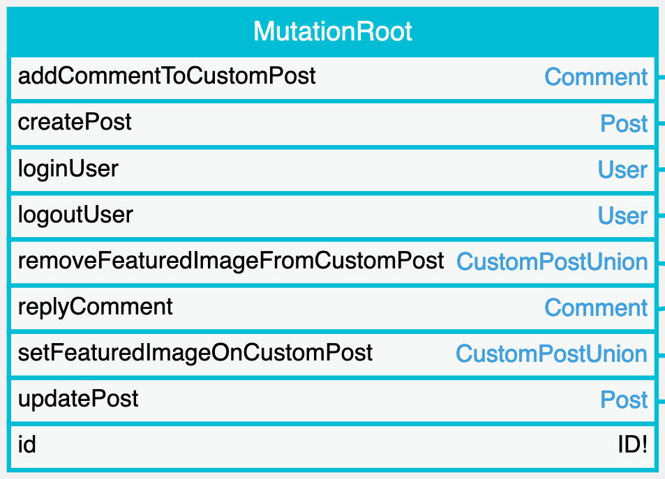

# Mutations

GraphQL mutations enable to modify data through the query, using the operation type `mutation`:

```graphql
mutation {
  updatePost(id: 5, title: "New title") {
    title
  }
}
```

All available mutation fields are listed under the `MutationRoot` type:

<a href="../../images/schema-mutations.png" target="_blank"></a>

